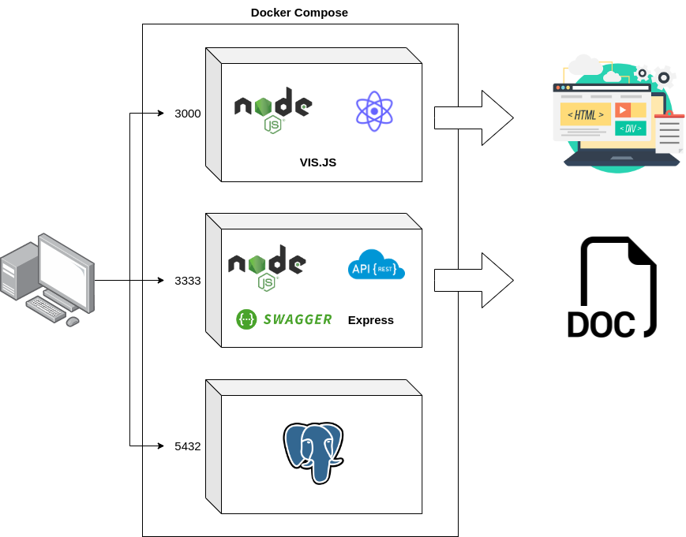

<h1>QSA info</h1>

 
    Uma aplicação para visualização das informações do QSA (Quadro de Sócios e Administradores) disponíveis nesse link:
https://bit.ly/3cRruVw, de modo que o sistema apresente as informações o mais rápido
possível. 

<h2> Histórias de usuário: </h2>

<ul>
    <li>
        

            Eu, como administrator de sistema, gostaria de abrir uma tela e visualizar a listagem do quadro societário em ordem de CPF em menos de 1s para uma listagem com 300 registros.
        

    </li>
    <li>
        

            Eu, como administrador do sistema, gostaria de pesquisar o nome de um sócio e visualizar as empresas a que ele está vinculado.
        

    </li>
</ul>

<h2> Arquitetura </h2>

Sistema composto com os componentes mostrados na figura acima. Sendo executados no Docker.

<ul>
    <li>
Frontend: Aplicação Node.js, React.js e Vis.js
</li>
    <li>
Backend: Aplicação Node.js, Express e Swagger
</li>
    <li>
Banco de dados: Um contêiner executando Postgres
</li>
</ul>

<h2> Requisitos do Sistema </h2>
<ul>
    <li> 
 Docker 
 </li>
    <li> 
 Docker Compose 
 </li>
</ul>

<h2> Configuração das credenciais para a aplicação executar de forma correta </h2>

Na pasta raiz do projeto crie um arquivo chamado <strong>.env</strong>.

Após a criação do arquivo escreva dentro dele os seguintes dados:

<blockquote>
DB_HOST=host do banco de dados postgres  
DB_PORT=porta do banco de dados postgres  
DB_NAME=nome do banco de dados  
DB_USER=usuário do banco  
DB_PASSWORD=senha de acesso ao banco de dados  
FRONTEND_PORT=porta em que a aplicação frontend está sendo executada  
BACKEND_PORT=porta em que a aplicação backend está sendo executada  
</blockquote>

Configure os dados acima de forma correta.

<h2>Comando para rodar o servidor com a aplicação</h2>
<blockquote> docker-compose up </blockquote>

<h2> Migração das tabelas para o banco </h2>

Entre na pasta /backend e execute o seguinte comando.

<blockquote>npx knex migrate:latest</blockquote>

<h3> Para visualizar a documentação da API Rest (Swagger). Acesse o link :</h3>
http://localhost:3333/api-docs

<h3> Para visualizar a aplicação acesse :</h3>
http://localhost:3000
